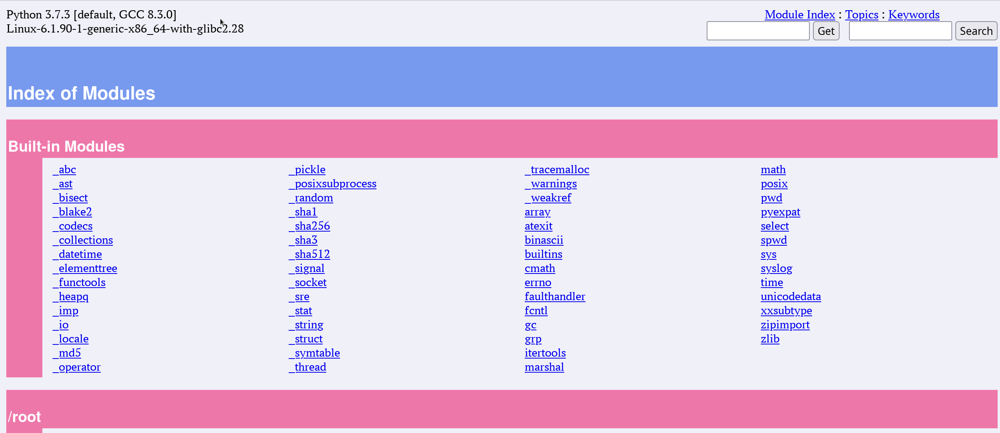

### Установка зависимостей на примере Debian\Ubuntu\Astra
```bash
sudo apt update
sudo apt install git build-essential libsystemd-dev
```


### Запуск команды сборки пакета
```bash
sudo su
chmod +x ./build.sh
./build.sh https://github.com/haproxy/haproxy.git-v2.6-dev12 TARGET=generic CPU=generic ARCH=
```

первая часть команды (далее аргумент) после имени файла отвечает за ссылку на репозиторий

в данном примере
- https://github.com/haproxy/haproxy.git - это ссылка на репозиторий
- v2.6-dev12 - это тег\бранч\ветка на которую нужно будет переключится во время клонирования репозитория с git сервера

для корректного чтения репозитория и ветки\тега\бранча части разделяются символом `-`, то есть если мы хотим собрать версию 3.3.4 (она под тегом v3.3-dev4), то url будет выглядить как `https://github.com/haproxy/haproxy.git-v3.3-dev4`


Аргумент `TARGET` отвечает под какую ОС мы собираем пакет

поддерживаемые параметры
```
- linux-glibc - стандартные Linux дистрибутивы Ubuntu, Debian, RHEL, CentOS, SUSE
- linux-glibc-legacy - Older kernels (< 2.6.28)
- linux-musl - Alpine Linux, embedded
- solaris - Oracle Solaris, OpenIndiana
- freebsd - FreeBSD
- freebsd-glibc - редкое используется FreeBSD при установленом glibc
- dragonfly - нишевые BSD системы
- openbsd - Сфокусированные на безопастности BSD
- netbsd - портативные BSD
- cygwin - Windows с POSIX эмуляцией 
- haiku - эксперементальные ОС
- aix51 - Legacy IBM Power systems
- aix52 - Legacy IBM Power systems
- aix72-gcc - современные AIX с GCC
- osx - macOS (Intel or Apple Silicon)
- generic - (значение по умолчанию если не переданно иное)
- custom
```

Аргумент `CPU` задает под какой ЦП мы собираем пакет

поддерживаемые параметры
```
generic (значение по умолчанию если не переданно иное) - максимальная совместимость интрукций процессора, медленная в сборке
native - максимальная совместимость инструкций установленного процессора в сервер
i586 - Legacy x86 (Pentium, K6)
i686 - Older x86 servers (Pentium II–IV)
ultrasparc - Legacy SPARC servers
power8 - High-end Power Systems (IBM)
power9 - High-end Power Systems (IBM) 
custom - пользовательский тюнинг сборки
a53 - ARM SoCs (Raspberry Pi, servers)
a72 - ARM SoCs (Raspberry Pi, servers)
armv81 - ARMv8.1-A
armv8-auto - Auto-detect ARMv8 features, безопасен для современных ARM64
```

Аргумент `ARCH` здает архитектуру под которую собирается пакет. Используется только если инструкции CPU не совпадают с `native` параметром. По умолчанию не задается.

Поддерживаемые параметры 
```
32, 64, x86_64, i386, i486, i586, i686
```

Больше информации о параметрах сборки можно почитать в зеркале на [github](https://github.com/haproxy/haproxy/blob/master/Makefile)

#### Поэтапный процесс сборки
1. проверка существования сервиса `haproxy` в системе (то есть, если процес в системе существут сборка прерывается)
2. проверка зависимостей (на существование пакетов `git`, `make`, `gcc`)
3. сбор переданных параметров сборки
4. клонирование репозитория
5. сборка самого пакета
6. конфигурация сервиса для systemd

После того как прошли все шаги у нас в системе будет сконфигурированны сервис haproxy

Проверить его статус можно через команду `systemctl status haproxy`.

Данный сервис имеет конфигурацию прокси, который слушает `80` порт и перенаправляет запросы на локальный `8080` порт.

Проверить работу можно локально запустив web версию документации python командой `python3 -m pydoc -p 8080`

Далее открыть браузер с адресом хоста или именем хоста (например http://client01.example.com/)

**Узнать адрес хоста\сервера**
```bash
ip a | grep inet
```

**Узнать имя хоста\сервера**
```bash
hostname -f
```

Пример отобраемой страницы




#### Где лежат файлы конфигурации сервиса
- базовый конфиг haproxy (файл haproxy.cfg) доступен по пути `/etc/haproxy/haproxy.cfg`
- конфигурация самого сервиса для systemd находится по пути `/lib/systemd/system/haproxy.service`
- исполняемый файл находится в дирректории `/usr/sbin/haproxy`

#### Проверка файла конфига прокси сервера 
```bash
sudo /usr/sbin/haproxy -c -f /etc/haproxy/haproxy.cfg
```

#### Описание системных дирректорий
```bash
/bin/       Essential command binaries that need to be available in single user mode;
            for all users, e.g., cat, ls, cp
/sbin/      Essential system binaries, e.g., init, ip, mount.
/usr/bin/   Non-essential command binaries (not needed in single user mode);
            for all users
/usr/sbin/  Non-essential system binaries, e.g. daemons for various network-services.
/usr/local/ Tertiary hierarchy for local data, specific to this host.
            Typically has further subdirectories, e.g., bin/, lib/, share/
```
